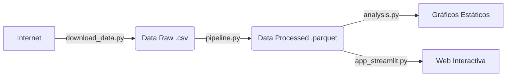

# 📘 Documentación Técnica del Código Fuente

**Proyecto:** Big Data & Geopolítica ("El Gran Juego") 
**Alumno:** Daniel Alexis Mendoza Corne
**Fecha:** Febrero 2026

---

## 1. ¿Por qué la carpeta se llama `src`?

`src` es la abreviatura estándar en ingeniería de software para **"Source"** (Código Fuente).

En proyectos profesionales, es fundamental mantener separado el código lógico de otros elementos. Esta estructura garantiza:

- **Orden:** El código no se mezcla con la documentación (`.md`), la configuración (`docker/`) o los datos (`data/`).
- **Seguridad:** Facilita la configuración de permisos; por ejemplo, el servidor de producción solo necesita acceso de lectura a `src`, pero de escritura a `data`.
- **Escalabilidad:** Si el proyecto crece, todo el código lógica reside en un único punto de verdad.

---

## 2. Catálogo de Scripts

A continuación, se detalla la función técnica y de negocio de cada módulo desarrollado.

### 🛠️ 1. Infraestructura y Preparación

#### `download_data.py`
- **Función:** Automatización de Ingesta.
- **Qué hace:** Se conecta al repositorio de la Universidad de Gotemburgo, descarga el dataset `.csv` de 68MB y lo coloca en la ruta `data/raw/`.
- **Por qué es importante:** Elimina la dependencia de descargas manuales, haciendo que el proyecto sea reproducible en cualquier máquina con un solo comando.

#### `verify_spark.py`
- **Función:** Test de Integridad (Smoke Test).
- **Qué hace:** Intenta iniciar una sesión de Spark y crear un DataFrame pequeño en memoria.
- **Por qué es importante:** Es el primer script que ejecutamos para validar que el contenedor de Docker y el cluster de Spark están comunicándose correctamente antes de lanzar procesos pesados.

---

### ⚙️ 2. Procesamiento de Datos (ETL)

#### `pipeline.py`
- **Función:** ETL (Extract, Transform, Load).
- **Tecnología:** Apache Spark (PySpark SQL).
- **Flujo de Trabajo:**
  1.  **Extract:** Lee el CSV crudo.
  2.  **Transform:**
      - Filtra los 5 países del "Gran Juego" (Afganistán, Mongolia, Cáucaso).
      - Crea la variable derivada `subregion`.
      - Castea tipos de datos (Strings a Doubles) para asegurar precisión matemática.
  3.  **Load:** Guarda el resultado limpio en formato **Parquet**.
- **Detalle Pro:** Usamos `.parquet` en lugar de `.csv` porque es un formato columnar comprimido que es mucho más rápido para leer en análisis posteriores de Big Data.

#### `ingest_data.py` (Módulo Legado)
- **Función:** Conector a Base de Datos Relacional.
- **Qué hace:** Estaba diseñado para cargar los datos en PostgreSQL.
- **Estado:** Se mantiene como respaldo. Para el análisis principal optamos por el flujo Spark-Parquet por ser más nativo del ecosistema de Big Data que el almacenamiento SQL tradicional.

---

### 🧠 3. Análisis Avanzado y Resultados

#### `analysis.py`
- **Función:** Motor de Machine Learning.
- **Tecnología:** Spark MLlib.
- **Qué hace:**
  - Carga los datos procesados (Parquet).
  - **Matriz de Correlación:** Calcula cómo se relacionan las variables (ej. Gasto Militar vs PIB).
  - **Random Forest:** Entrena un modelo de Inteligencia Artificial compuesto por 100 árboles de decisión para predecir el desarrollo económico.
  - **Feature Importance:** Extrae qué variables tuvieron más peso en la decisión del modelo.
- **Salida:** Genera automáticamente los gráficos estáticos `.png` en la carpeta `notebooks/`.

#### `app_streamlit.py`
- **Función:** Interfaz de Usuario (Frontend).
- **Tecnología:** Streamlit + Plotly.
- **Qué hace:**
  - Levanta un servidor web interactivo en el puerto `8501`.
  - Permite al usuario explorar los datos: filtrar por año, ver tendencias temporales interactivas y simular predicciones.
  - Es la "cara" del proyecto, transformando el código técnico en un producto visual consumible por un usuario final.

---

## 3. Diagrama de Flujo de Datos

