# 📡 Análisis Computacional de Geopolítica: El "Gran Juego" Post-Soviético

> **Un enfoque de Big Data para entender la economía y seguridad en Asia Central.**

<div align="center">
    
    <h3>👤 Daniel Alexis Mendoza Corne</h3>
    <p>
        <b>Carrera:</b> Ingeniería Informática y de Sistemas  <br> 
        <b>Nacionalidad:</b> Peruana 🇵🇪 <br>
        <a href="https://www.linkedin.com/in/alexismendoza12/">
            
        </a>
    </p>
</div>

---

## 📌 Resumen Ejecutivo

Este proyecto aplica técnicas de **Big Data** e **Ingeniería de Software** para resolver una pregunta fundamental de las Ciencias Políticas:

> _"¿Son los factores de 'Poder Duro' (Gasto Militar) o de 'Poder Blando' (Democracia, Control de Corrupción) los que determinan el desarrollo económico en la periferia post-soviética?"_

A través de un pipeline automatizado, se procesaron décadas de datos históricos de países clave del **"Gran Juego"** (Afganistán, Mongolia, Cáucaso) para modelar matemáticamente sus trayectorias de desarrollo.

### 🛠️ Tech Stack


---

## 🏗️ Arquitectura del Sistema

El proyecto implementa un flujo de datos moderno y contenerizado:

```mermaid
graph TD
    %% Estilos
    classDef source fill:#f9f,stroke:#333,stroke-width:2px;
    classDef script fill:#bbf,stroke:#333,stroke-width:2px,color:black;
    classDef data fill:#dfd,stroke:#333,stroke-width:2px,color:black;
    classDef output fill:#fd9,stroke:#333,stroke-width:2px,color:black,stroke-dasharray: 5 5;

    subgraph INGESTA ["📡 Ingesta de Datos"]
        A[☁️ Internet / Repo QoG]:::source
        Script1{{🐍 download_data.py}}:::script
    end

    subgraph PROCESAMIENTO ["⚙️ Procesamiento & Análisis"]
        Script2{{⚡ pipeline.py}}:::script
        Script3{{🧠 analysis.py}}:::script
        Script5{{📉 econometric_analysis.py}}:::script
    end

    subgraph ALMACENAMIENTO ["💾 Almacenamiento"]
        B[(📄 Raw CSV)]:::data
        C[(📦 Clean Parquet)]:::data
    end

    subgraph VISUALIZACION ["📊 Consumo & UI"]
        Script4{{🚀 app_streamlit.py}}:::script
        D[📈 Gráficos Estáticos .png]:::output
        E[🖥️ Dashboard Interactivo]:::output
        F[📄 Reporte Hausman .txt]:::output
    end

    %% Relaciones
    A --> Script1
    Script1 --> B
    B --> Script2
    Script2 --> C
    C --> Script3
    C --> Script4
    C --> Script5
    Script3 --> D
    Script4 --> E
    Script5 --> F
```



- **Infraestructura:** Docker Compose orquestando JupyterLab, Spark Master/Worker.
- **ETL:** PySpark para limpieza y transformación (`.parquet`).
- **Analítica:**
    - **Machine Learning:** Random Forest (Spark MLlib) para Feature Importance.
    - **Econometría:** Modelos de Datos de Panel (Fixed Effects vs Random Effects) y Test de Hausman.
- **Frontend:** Dashboard interactivo en Streamlit para exploración de datos.

---

## 🔍 Hallazgos Principales

### 1. Inteligencia Artificial (Random Forest)
El modelo identificó que, descontando la salud básica (`Esperanza de Vida`), los factores de **Seguridad y Estabilidad del Régimen** tienen un peso predictivo superior a la mera democratización.

### 2. Validación Econométrica (Test de Hausman)
Se aplicó un **Test de Hausman** comparando modelos de Efectos Fijos vs Aleatorios.
- **Resultado:** Se prefirió el modelo de **Efectos Fijos** ($P < 0.05$).
- **Interpretación:** Las características únicas e invariables de cada país ("El estilo uzbeko", "La geografía afgana") son determinantes estructurales del éxito o fracaso económico, confirmando la hipótesis de heterogeneidad regional.

---

## 🚀 Instrucciones de Despliegue

```bash
# 1. Levantar la infraestructura
docker compose up -d

# 2. Descargar e Ingestar Datos
docker exec jupyter_lab python /home/jovyan/work/src/download_data.py

# 3. Ejecutar Pipeline ETL (Raw -> Parquet)
docker exec jupyter_lab python /home/jovyan/work/src/pipeline.py

# 4. Entrenar Modelo de Machine Learning (Spark)
docker exec jupyter_lab spark-submit /home/jovyan/work/src/analysis.py

# 5. Ejecutar Análisis Econométrico (Hausman)
docker exec jupyter_lab python /home/jovyan/work/src/econometric_analysis.py

# 6. Lanzar Dashboard Web (http://localhost:8501)
docker exec -d jupyter_lab streamlit run /home/jovyan/work/src/app_streamlit.py
```

---

## 📂 Estructura del Repositorio

```text
├── 01_README.md                # Portada del proyecto (Este archivo)
├── 02_INFRAESTRUCTURA.md       # Documentación técnica de Docker
├── 03_RESULTADOS.md            # Informe detallado de hallazgos
├── 04_REFLEXION_IA.md          # Bitácora de co-creación con IA
├── 05_EXPLICACION_CODIGO.md    # Catálogo de scripts
├── 06_RESPUESTAS.md            # Preguntas de defensa
├── docker-compose.yml          # Orquestación
├── src/                        # Código Fuente Python
│   ├── pipeline.py             # Lógica ETL Big Data
│   ├── analysis.py             # ML Engine
│   ├── econometric_analysis.py # Stats Engine
│   └── app_streamlit.py        # Web App
└── data/                       # Lakehouse (Raw + Processed)
```
