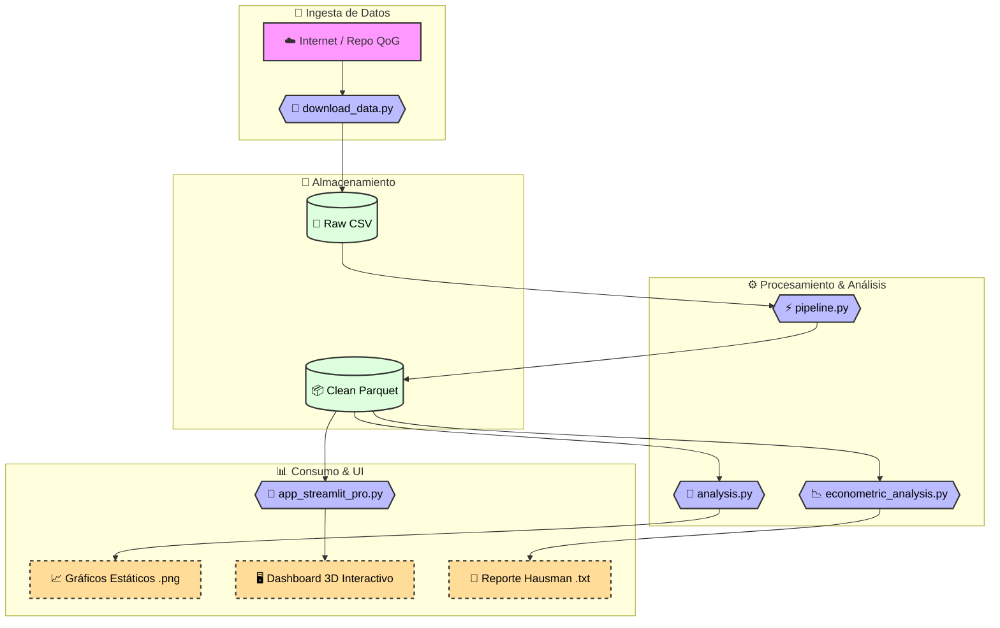

# 📘Paso 5: Documentación Técnica del Código Fuente

**Proyecto:** Big Data & Geopolítica ("El Gran Juego")
**Alumno:** Daniel Alexis Mendoza Corne
**Fecha:** Febrero 2026

---

## 1. ¿Por qué la carpeta se llama `src`?

`src` es la abreviatura estándar en ingeniería de software para **"Source"** (Código Fuente).

En proyectos profesionales, es fundamental mantener separado el código lógico de otros elementos. Esta estructura garantiza:

- **Orden:** El código no se mezcla con la documentación (`.md`), la configuración (`docker/`) o los datos (`data/`).
- **Seguridad:** Facilita la configuración de permisos; por ejemplo, el servidor de producción solo necesita acceso de lectura a `src`, pero de escritura a `data`.
- **Escalabilidad:** Si el proyecto crece, todo el código lógica reside en un único punto de verdad.

---

## 2. Catálogo de Scripts

A continuación, se detalla la función técnica y de negocio de cada módulo desarrollado.

### 🛠️ 1. Infraestructura y Preparación

#### `download_data.py`

- **Función:** Automatización de Ingesta.
- **Qué hace:** Se conecta al repositorio de la Universidad de Gotemburgo, descarga el dataset `.csv` de 68MB y lo coloca en la ruta `data/raw/`.
- **Por qué es importante:** Elimina la dependencia de descargas manuales, haciendo que el proyecto sea reproducible en cualquier máquina con un solo comando.

#### `verify_spark.py`

- **Función:** Test de Integridad (Smoke Test).
- **Qué hace:** Intenta iniciar una sesión de Spark y crear un DataFrame pequeño en memoria.
- **Por qué es importante:** Es el primer script que ejecutamos para validar que el contenedor de Docker y el cluster de Spark están comunicándose correctamente antes de lanzar procesos pesados.

---

### ⚙️ 2. Procesamiento de Datos (ETL)

#### `pipeline.py`

- **Función:** ETL (Extract, Transform, Load).
- **Tecnología:** Apache Spark (PySpark SQL).
- **Flujo de Trabajo:**
  1.  **Extract:** Lee el CSV crudo.
  2.  **Transform:**
      - Filtra los 5 países del "Gran Juego" (Afganistán, Mongolia, Cáucaso).
      - Crea la variable derivada `subregion`.
      - Castea tipos de datos (Strings a Doubles) para asegurar precisión matemática.
  3.  **Load:** Guarda el resultado limpio en formato **Parquet**.
- **Detalle Pro:** Usamos `.parquet` en lugar de `.csv` porque es un formato columnar comprimido que es mucho más rápido para leer en análisis posteriores de Big Data.

#### `ingest_data.py` (Módulo Legado)

- **Función:** Conector a Base de Datos Relacional.
- **Qué hace:** Estaba diseñado para cargar los datos en PostgreSQL.
- **Estado:** Se mantiene como respaldo. Para el análisis principal optamos por el flujo Spark-Parquet por ser más nativo del ecosistema de Big Data que el almacenamiento SQL tradicional.

---

### 🧠 3. Análisis Avanzado y Resultados

#### `analysis.py`

- **Función:** Motor de Machine Learning.
- **Tecnología:** Spark MLlib.
- **Qué hace:**
  - Carga los datos procesados (Parquet).
  - **Matriz de Correlación:** Calcula cómo se relacionan las variables (ej. Gasto Militar vs PIB).
  - **Random Forest:** Entrena un modelo de Inteligencia Artificial compuesto por 100 árboles de decisión para predecir el desarrollo económico.
  - **Feature Importance:** Extrae qué variables tuvieron más peso en la decisión del modelo.
- **Salida:** Genera automáticamente los gráficos estáticos `.png` en la carpeta `notebooks/`.

#### `econometric_analysis.py`

- **Función:** Análisis Econométrico Riguroso.
- **Tecnología:** Librería `linearmodels` (Python).
- **Qué hace:**
  - Ejecuta modelos de regresión para datos de panel: **Efectos Fijos (Fixed Effects)** y **Efectos Aleatorios (Random Effects)**.
  - Implementa el **Test de Hausman** para determinar cuál de los dos modelos es estadísticamente más adecuado (causalidad vs correlación).
  - Genera un reporte detallado en `notebooks/hausman_results.txt`.
- **Valor agregado:** Complementa la "caja negra" del Machine Learning (Random Forest) con inferencia estadística clásica, validando si las características únicas de cada país sesgan los resultados.

---

### 🚀 4. Interfaz de Usuario (Frontend)

#### `src/app_streamlit.py` y `src/app_streamlit_pro.py`

Son el Frontend de la aplicación.

- **Tecnología:** Streamlit.
- **Funciones:**
  - Cargar el Parquet procesado.
  - Generar gráficos interactivos con Plotly.
  - **Pro Version:** Incluye globo 3D, radar charts y estética "Dark Mode".
  - Sirve una interfaz web en el puerto `8501`.
  - Permite al usuario explorar los datos: filtrar por año, ver tendencias temporales interactivas y simular predicciones.
  - Es la "cara" del proyecto, transformando el código técnico en un producto visual consumible por un usuario final.

---

## 3. Diagrama de Flujo de Datos

> [!NOTE]
> **Conclusión del Flujo de Datos:**  
> Como se observa en el diagrama, el proyecto sigue una arquitectura lineal de Big Data moderna:
>
> 1.  **Ingesta:** Los datos se capturan automáticamente de internet (`download_data.py`).
> 2.  **Procesamiento:** Se limpian y estructuran en Spark (`pipeline.py`), guardándose en formato eficiente **Parquet**.
> 3.  **Consumo:** A partir del dato limpio, se derivan tres productos finales: Análisis ML (`analysis.py`), Validación Estadística (`econometric_analysis.py`) y Visualización Interactiva (`app_streamlit_pro.py`).
>
> Esta estructura modular asegura que si cambiamos la fuente de datos, solo tocamos el script de _Ingesta_, sin romper el Dashboard final.

---

## 4. DevOps y Documentación 📚

Para desplegar este sitio web, utilizamos dos archivos clave que a menudo se confunden pero tienen propósitos muy distintos:

### `mkdocs.yml` (El Cerebro 🧠)

**Ubicación:** Raíz del proyecto.
**Función:** Configuración del Sitio Web.
**Qué hace:**

- Define el título del sitio, el autor y el tema visual ("Material").
- Estructura el menú de navegación lateral.
- Activa plugins y extensiones (como Mermaid para los gráficos).
- **Es el archivo que tú editas** cuando quieres cambiar el contenido, el orden de las páginas o el color del sitio.

### `.github/workflows/deploy_docs.yml` (El Obrero 👷)

**Ubicación:** `.github/workflows/` (antes llamado `mkdocs.yml`).
**Función:** Automatización del Despliegue (CI/CD).
**Qué hace:**

- Es un script de instrucciones para los servidores de GitHub (GitHub Actions).
- Cada vez que haces un cambio (`git push`), este archivo le dice a GitHub:
  1. "Instala Python y MkDocs".
  2. "Instala los plugins necesarios (Material, Mermaid)".
  3. "Construye la página web estática".
  4. "Publicala en internet (GitHub Pages)".
- **No necesitas editarlo casi nunca**, salvo que cambies la forma de desplegar el sitio.
